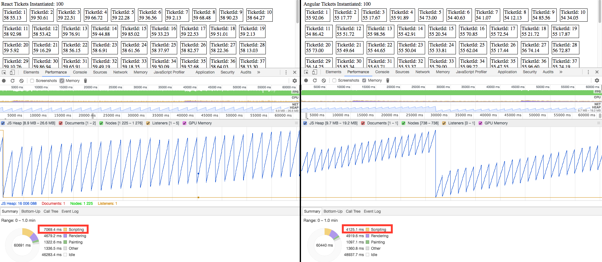
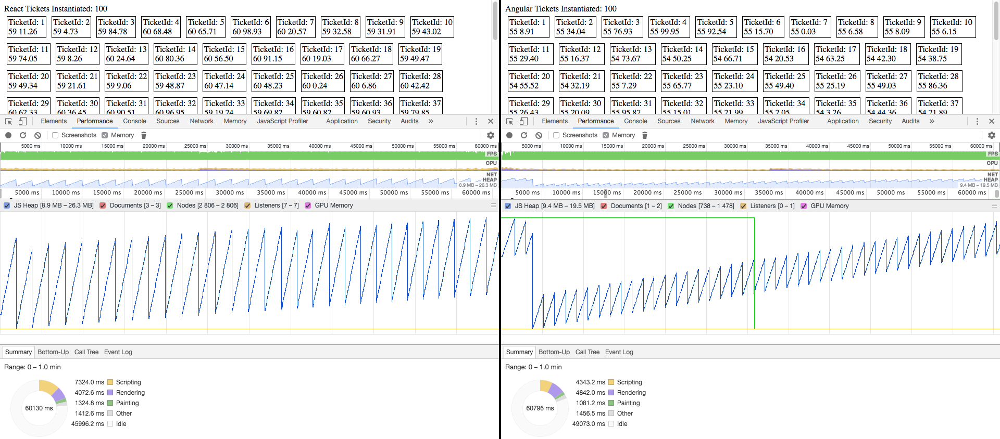
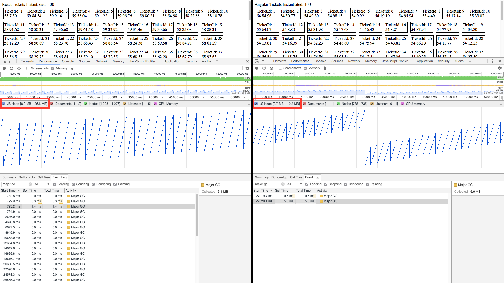
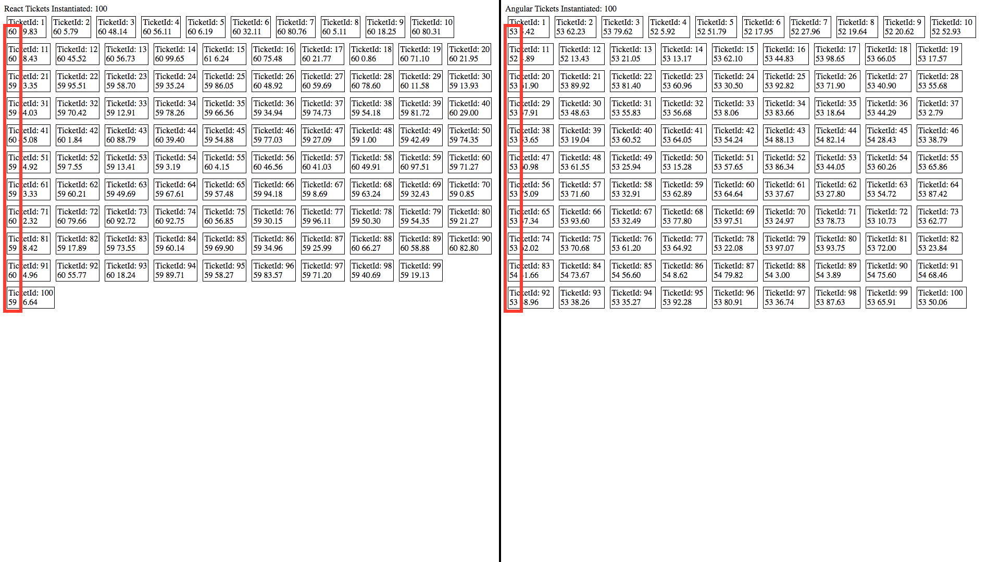

# Overview

This repo contains 2 projects with feature parity, one based on React v15 and one based 
on Angular 4. Aside from RxJS, there are no additional libraries outside the framework 
itself and no clutter. The Angular app was generated with the 
[Angular CLI](https://github.com/angular/angular-cli) and the React app was generated 
with [create-react-app](https://github.com/facebookincubator/create-react-app). 
Performance Results were calculated for each using optimized production builds of each.

The purpose of these 2 projects is to compare Angular and React rendering performance in 
scenarios where there are many DOM elements updating extremely quickly, which is a common 
in industries consuming real-time data feeds.
 
Each app instantiates a preset number of simple components (configured through 
`initialQuantity` property in [app.component.ts](./ang/src/app/app.component.ts) and
 [App.js](./react/src/App.js)). Each component kicks off an RxJS Observable data stream 
 that publishes every 50ms. Each component contains 2 bindings that update on each tick, 
 where the first binding represents the timeInterval from the previous update to the 
 current and the 2nd binding contains the updated data it received from the Observable. 

# Procedure
1. Close as many open apps as possible on the machine as possible to prevent possible
 resource contention (CPU, Memory, I/O, ...) that could compromise test results.
1. Prepare a fresh Chrome: Disable any relevant extensions, clear caches, close all other
 tabs/windows, etc.
1. Run `npm install` from both Angular and React app project roots.
1. Set the `initialQuantity` property in both [app.component.ts](./ang/src/app/app.component.ts) 
and [App.js](./react/src/App.js)) to the desired number of controls you'd like to test.
1. Run production optimized builds of both apps from each project root `npm run build`
1. Serve up the generated assets using your favorite http-server for each project (one 
project at a time). I use `npm install -g serve` `serve -s build`
1. We are focused on update speed and not initial load so wait until the DOM loads and
 then run the Performance Test from Chrome Developer Tools for your test duration.
1. For each test run, record the exact scripting time and total test duration.
1. Make sure to start fresh for each test, close the page, clear the cache, clear the 
performance profiler.

# Results

tldr: Angular consistently outperforms React in its ability to quickly deliver real-time 
data updates to the UI. We currently include results both stats and screenshots for 20
 test runs found under test-results](./test-results) 

## Environment:
- macOS Sierra (10.12.5)
- Chrome 58.0.3029.110 (64-bit)
- MacBook Pro (Retina, Mid 2012) 2.6 GHz i7
- 512gb SSD
- 16 GB DDR3
- nVidia GeForce GT 650M 1024 MB

## Test Approach
- Test 1: 500 Components, 50 ms updates, ~30 seconds
- Test 2: 100 Components, 50 ms updates, ~30 seconds
- 5 Runs of each test per framework
- Take screenshot of profile output.
- Record total test duration, scripting duration, and percentage of total test duration 
spent Scripting. We use the percentage of the total time instead of an absolute number 
since the tooling makes it difficult to set an precise test duration. 

## Findings

### Scripting

Angular spends a much lower percentage of time scripting than React. 
For 500 Components, we found that our React app averaged 21% more time scripting than 
our Angular app (44.5% to 53.9). At 100 Components, we found that React spent a much 
larger 92% increase in the time spent scripting versus Angular.

*See the [Test Results Spreadsheet](./test-results/perf-results.htm) for the entire data set*

| TestId | Type | Components | Run # | Total Duration (ms) | Scripting (ms) | % of Test Time Spent Scripting |
| ------ | ----- | --------- | ----- | ------------------- | -------------- | ------------------------------ |
| 1	|   React	|    500	 |      1 |	        30,452 	   |        16,727  |  54.9% |
| 2	|   React	|    500	 |      2 |	        30,871 	   |        17,609  |  57.0% |
| 3	|   React	|    500	 |      3 |	        30,862 	   |        15,893  |  51.5% |
| 4	|   React	|    500	 |      4 |	        30,348 	   |        16,087  |  53.0% |
| 5	|   React	|    500	 |      5 |	        30,512 	   |        16,154  |  52.9% |
|				|    		                                                      
| 6	|   React	|    100	 |      1 |	        30,570 	   |        3,895 	|  12.7% |
| 7	|   React	|    100	 |      2 |	        29,890 	   |        3,564 	|  11.9% |
| 8	|   React	|    100	 |      3 |	        30,615 	   |        3,575 	|  11.7% |
| 9	|   React	|    100	 |      4 |	        30,486 	   |        3,564 	|  11.7% |
| 10 |	React	|    100	 |      5 |	        30,271 	   |        3,745 	   12.4% |
|				                                                                     |    
| 11 |	Angular	|    500	 |      1 |	        30,451 	   |        13,750  | 	45.2% |
| 12 |	Angular	|    500	 |      2 |	        30,611 	   |        13,592  | 	44.4% |
| 13 |	Angular	|    500	 |      3 |	        31,021 	   |        13,694  | 	44.1% |
| 14 |	Angular	|    500	 |      4 |	        30,383 	   |        13,583  | 	44.7% |
| 15 |	Angular	|    500	 |      5 |	        30,369 	   |        13,349  | 	44.0% |
|	                                                                                  |
| 16 |	Angular	|    100	 |      1 |	        30,084 	   |        1,986 	|    6.6% |
| 17 |	Angular	|    100	 |      2 |	        29,801 	   |        1,915   |    6.4% |
| 18 |	Angular	|    100	 |      3 |	        30,257 	   |        1,956	|    6.5% |
| 19 |	Angular	|    100	 |      4 |	        30,292 	   |        1,817 	|    6.0% |
| 20 |	Angular	|    100	 |      5 |	        30,406 	   |        1,851 	|    6.1% |

### Memory

##### React Major GC Memory Usage 1

##### React Major GC Memory Usage 2

##### React Major GC Memory

### Visuals

Using RxJS timeInterval() as a simple visual representation of thoroughput, Angular 
components consistently show lower time intervals than React. 
Due to the single-threaded nature of JavaScript, the RxJS timeInterval (1st binding) is a 
simple visual representation of how quickly each framework can process a data update 
given a consistent number of microtasks on the event loop - the closer it is to the 
publisher's 50ms rate, the better.

##### Visual Lag clearly visible in React app on left

